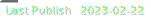

# [submelon.dev](https://submelon.dev)

  

A "link-in-bio" site of sorts, with other resources available for reference.

## Description

This is a static site that is not generated (anymore). All sources except for the brand icons were produced solely by the author, Kevin Hoerr.

## License

This project is licensed under [the Blue Oak Model License 1.0.0](LICENSE.md).

## Hosting

The site itself is served using DigitalOcean's App capabilities for static sites. This is a zero-cost service with automated deployments, as enabled by DigitalOcean and GitHub services and integrations.

